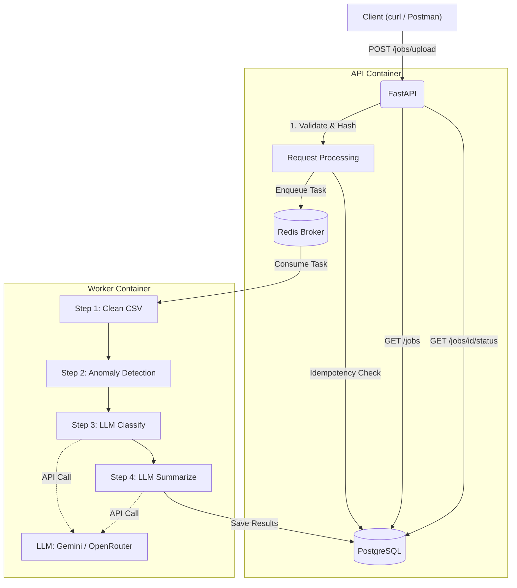

# Transaction Processing Pipeline

A production-grade async CSV analysis service that cleans financial transaction data, detects anomalies, and generates LLM-powered narratives. Built with FastAPI, Celery, PostgreSQL, Redis, and Gemini.

## Features
- **Asynchronous Processing**: Non-blocking Celery pipeline for CPU-intensive data cleaning and network-bound LLM tasks.
- **Idempotency**: Duplicate CSV uploads (based on SHA-256 hash) immediately return cached results without reprocessing.
- **LLM Circuit Breaking & Resilience**: Primary integration with Gemini 2.5 Flash, automatically falling back to OpenRouter upon rate limits (429) or failures.
- **Observability**: Fully structured JSON logging with `structlog`, complete with `X-Request-ID` propagation across API and Celery workers.
- **Robust Anomaly Engine**: Detects statistical outliers (3x median), currency mismatches (e.g., USD at domestic merchants), and suspicious notes.
- **Audit Logging**: Every status transition is tracked for full traceability.

---

## 🏗 Architecture

**High-Level Architecture Diagram:** [View on draw.io (Public)](https://viewer.diagrams.net/?tags=%7B%7D&lightbox=1&highlight=0000ff&edit=_blank&layers=1&nav=1&dark=auto#G1Si8VNIFWoJHrmbak_QVtRoucu6Ferw6f)

**Demo Video Walkthrough:** [Watch on Google Drive](https://drive.google.com/drive/folders/1YqFT8Imo86n1NyCFD9vKS6G_X3qMj29f?usp=sharing)



---

## 🚀 One-Command Setup

Make sure you have Docker and Docker Compose installed.

1. Clone the repository and navigate into it.
2. Create your environment file:
   ```bash
   cp .env.example .env
   ```
3. Add your LLM keys to `.env` (`GEMINI_API_KEY` and `OPENROUTER_API_KEY`).
4. Boot the stack using the provided Makefile:
   ```bash
   make start
   ```
   *(This runs `docker compose build`, `docker compose up -d`, and `alembic upgrade head`)*

The API will be available at [http://localhost:8000/docs](http://localhost:8000/docs).
Celery monitoring (Flower) will be available at [http://localhost:5555](http://localhost:5555).

---

## 📖 Endpoints & `curl` Examples

### 1. Upload CSV
Uploads a new CSV file, hashes it for idempotency, and enqueues a Celery task.
```bash
curl -X POST "http://localhost:8000/jobs/upload" \
  -H "accept: application/json" \
  -H "Content-Type: multipart/form-data" \
  -F "file=@transactions.csv;type=text/csv"
```
**Response (201 Created / 200 OK for duplicates):**
```json
{
  "job_id": "99f7c471-e9b4-4b60-b76f-94b52293392c",
  "status": "pending",
  "message": "File uploaded and job enqueued successfully.",
  "is_duplicate": false
}
```

### 2. Check Job Status
Check the status of the background processing. Returns the generated summary if completed.
```bash
curl -X GET "http://localhost:8000/jobs/99f7c471-e9b4-4b60-b76f-94b52293392c/status"
```
**Response (200 OK):**
```json
{
  "job_id": "99f7c471-e9b4-4b60-b76f-94b52293392c",
  "status": "completed",
  "progress_percent": 100,
  "summary": {
    "total_spend_inr": 45000.5,
    "total_spend_usd": 120.0,
    "anomaly_count": 2,
    "risk_level": "medium",
    "narrative": "A total of 45,000 INR and 120 USD was spent. 2 anomalies detected regarding international transactions."
  }
}
```

### 3. Get Job Results (Transactions)
Fetch paginated transactions for a completed job, including anomaly flags and LLM-assigned categories.
```bash
curl -X GET "http://localhost:8000/jobs/99f7c471-e9b4-4b60-b76f-94b52293392c/results?skip=0&limit=10"
```

### 4. List Jobs
List all jobs with pagination and status filtering.
```bash
curl -X GET "http://localhost:8000/jobs?status=completed&limit=10"
```

### 5. Health Check
Verifies connections to PostgreSQL, Redis, and Celery, and reports Circuit Breaker stats.
```bash
curl -X GET "http://localhost:8000/health"
```

---

## ⚙️ Environment Variables (`.env`)

| Variable | Description | Required? |
|----------|-------------|-----------|
| `DATABASE_URL` | AsyncPG connection string for PostgreSQL | Yes |
| `DATABASE_URL_SYNC` | Sync psycopg2 connection string for Alembic | Yes |
| `REDIS_URL` | Redis instance URL | Yes |
| `CELERY_BROKER_URL` | Redis broker URL for Celery | Yes |
| `CELERY_RESULT_BACKEND`| Redis result backend for Celery | Yes |
| `GEMINI_API_KEY` | Your Google Gemini API Key | Yes |
| `OPENROUTER_API_KEY` | Your OpenRouter API Key (Failover) | Yes |

---

## 🧪 Testing

The test suite is built with `pytest`, `pytest-asyncio`, and `httpx`. It uses the `api` container environment but bypasses the network by running inside the container directly.

To run the full suite (Unit + Integration):
```bash
make test
```

To run specifically unit or integration tests:
```bash
make test-unit
make test-integration
```

---

## 🛠 Troubleshooting

**1. Database Migration Errors (`relation "X" already exists`)**
Run `make clean` to wipe the volumes and start fresh:
```bash
make clean
make start
```

**2. Celery Worker Not Picking Up Tasks**
Check the worker logs for connection issues or missing dependencies:
```bash
make logs-worker
```

**3. API Returning 429 Too Many Requests on Uploads**
The API has a Redis-backed rate limiter for uploads (e.g., max 5 uploads / minute). Wait a minute and try again.

**4. LLM Classification Failing**
If both Gemini and OpenRouter fail, the job won't crash. The transactions will retain `"Uncategorised"` and the system will proceed to completion, marking `llm_calls_failed` in the job statistics. You can view the raw error traces in the `error_message` field or by checking worker logs.
